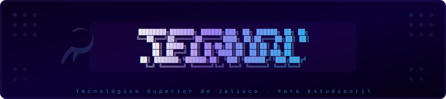

 

 

Foro estudiantil para la comunidad del **Tecnológico Superior de Jalisco** — un espacio digital donde alumnos, maestros y administrativos pueden compartir ideas, noticias y recursos de forma organizada.

> Documentación técnica, diagramas y decisiones de diseño en [`docs/`](docs/)

---

## El problema que resuelve

El Tecnológico Superior de Jalisco Lagos de Moreno carece de un espacio digital centralizado donde su comunidad pueda comunicarse de forma efectiva. La información sobre eventos, avisos, proyectos y recursos académicos se dispersa entre grupos de WhatsApp, redes sociales y correos institucionales, dificultando el acceso y la participación de toda la comunidad.

**TecNow** resuelve esto creando un foro institucional propio donde toda la información relevante vive en un solo lugar, organizada por comunidades, con roles definidos y moderación interna.

> *"Tu comunidad, tu voz, en tiempo real."*

---

## ¿Qué es TecNow?

TecNow es una plataforma de foro estilo Reddit adaptada al contexto del TSJ Lagos. La comunidad puede crear posts, comentar, votar contenido, compartir fotos y videos, y organizarse en subcomunidades por carrera, materia o tema de interés.

- Publicaciones de texto, imágenes y video
- Sistema de votos y comentarios anidados
- Subcomunidades por carrera o tema
- Roles diferenciados: alumno, maestro y administrador
- Moderación interna de contenido
- Notificaciones en tiempo real con Livewire
- Búsqueda de contenido y usuarios

---

## Stack tecnológico

| Capa | Tecnología |
|---|---|
| Backend | Laravel 12 / PHP 8.3 |
| Frontend | Livewire 3 + Alpine.js |
| Estilos | Tailwind CSS 3 |
| Base de datos | MySQL 8.0 |
| Admin panel | FilamentPHP |
| CI/CD | GitHub Actions |

---

## Consideraciones importantes

**Roles y permisos**
El sistema maneja tres roles: `alumno`, `maestro` y `admin`. Cada rol tiene permisos diferenciados para crear, moderar y eliminar contenido. Los administradores tienen acceso al panel de FilamentPHP.

**Moderación**
Todo contenido puede ser reportado por cualquier usuario. Los moderadores reciben notificaciones de reportes y pueden ocultar o eliminar publicaciones que violen las reglas de la comunidad.

**Autenticación institucional**
El registro se valida con correo institucional para garantizar que solo miembros de la institución accedan a la plataforma.

**Rendimiento**
Los feeds de posts y comentarios usan paginación lazy con Livewire. Las consultas pesadas se procesan con Jobs en cola para no bloquear la interfaz.

**Privacidad**
Ningún dato personal se expone públicamente sin consentimiento del usuario.

---

## Documentación

Diagramas de arquitectura, modelo entidad-relación y decisiones de diseño disponibles en [`docs/`](docs/).

---

Desarrollado por el equipo: ChrisraaaLopez, JonhP-creator, DiazC23, delmanu.

